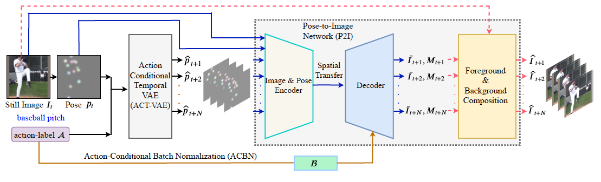

This is a pytorch project for the paper **Conditional Temporal Variational AutoEncoder for Action Video Prediction**


## Introduction

To synthesize a realistic action sequence based on a single human image, it is crucial to model both motion patterns and diversity in the action video.
This paper proposes an Action Conditional Temporal Variational AutoEncoder (ACT-VAE) to improve motion prediction accuracy and capture movement diversity.
ACT-VAE predicts pose sequences for an action clips from a single input image. It is implemented as a deep generative model that maintains temporal coherence according to the action category with a novel temporal modeling on latent space. Further, ACT-VAE is a general action sequence prediction framework. When connected with a plug-and-play Pose-to-Image (P2I) network, ACT-VAE can synthesize image sequences. Extensive experiments bear out our approach can predict accurate pose and synthesize realistic image sequences, surpassing state-of-the-art approaches.
Compared to existing methods, ACT-VAE improves model accuracy and preserves diversity.




[paper link](https://jiaya.me/publication/)

## Project Outline

Here is how the project is arranged and developed:
- train_actvae.py: the script to train the module of ACT-VAE
- train_actvae_p2inetwork.py: the script to train the module of P2I network
- trainer_actvae.py: the training and testing function for the module of ACT-VAE
- trainer_actvae_p2inetwork.py: the training and testing function for the module of P2I network
- network_actvae.py: the network structures for building and training ACT-VAE
- network_actvae_p2inetwork.py: the network structures for building and training P2I network
- dataset: the dataloader for training (image_loader2.py) and testing (image_loader2_test.py)
- config: the configuration file for training ACT-VAE module (Penn_pose_pred_time_2.yaml) and P2I network (Penn_pose_pred_time128_2.yaml)
- utils: utility functions used in the project
- utils_file.py: utility functions used in the project
- vgg.py: the perceptual loss
- model_variants.py: the code for P2I network

## Project Setup

First install Python 3. We advise you to install Python 3 and PyTorch with Anaconda:

```
conda create --name py36 python=3.6
source activate py36
```

Clone the repo and install the complementary requirements:
```
cd $HOME
git clone --recursive git@github.com:xiaogang00/ACT-VAE.git
cd ACT-VAE
pip install -r requirements.txt
```

## Prepare dataset:
- Download Penn dataset from http://dreamdragon.github.io/PennAction and store it in one path.

- the training sequences with their action ids, pose information and mask information are stored in training_pair_penn5.txt and testing_pair_penn5.txt, please modify the corresponding paths of images.

## Training

To train the ACT-VAE

```
python train_actvae.py --config config/Penn_actvae.yaml --name _test
```

To train the P2I network

```
python train_actvae_p2inetwork.py --config config/Penn_actvae_p2inetwork.yaml --name _generate --vae_path outputs/Penn_actvae/checkpoints
```


## Testing

To synthesize the pose sequence with ACT-VAE

```
python train_actvae.py --config config/Penn_actvae.yaml --name _test --test --resume
```

To synthesize the image sequence with ACT-VAE and P2I network


```
python train_actvae_p2inetwork.py --config config/Penn_actvae_p2inetwork.yaml --name _generate --test --resume
```

## Pretrained Model

You can download the pretrained models from https://drive.google.com/file/d/1tNZCr6TV8uXsvPs9XyJmj52ABH_If_Cl/view?usp=sharing.


## Citation Information

If you find the project useful, please cite:

```
@article{xu2021actvae,
  title={Conditional Temporal Variational AutoEncoder for Action Video Prediction},
  author={Xiaogang Xu, Yi Wang, Liwei Wang, Bei Yu and Jiaya Jia},
  journal={arxiv},
  year={2021}
}
```


## Acknowledgments
This source code is inspired by [MUNIT](https://github.com/NVlabs/MUNIT) and [Pose-Transfer](https://github.com/tengteng95/Pose-Transfer).

## Contributions
If you have any questions/comments/bug reports, feel free to e-mail the author Xiaogang Xu ([xgxu@cse.cuhk.edu.hk](xgxu@cse.cuhk.edu.hk)).

